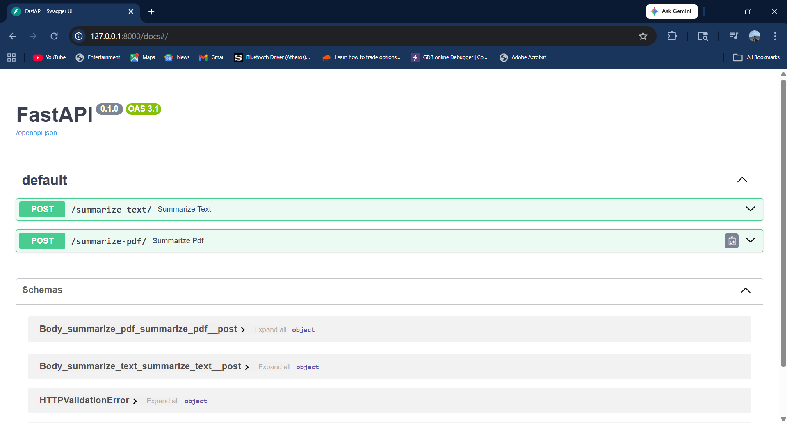
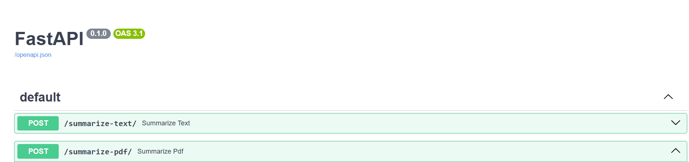
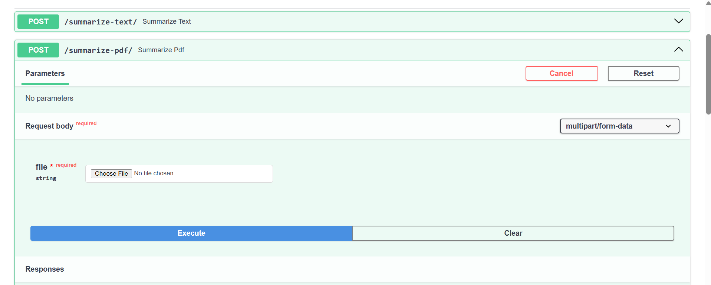
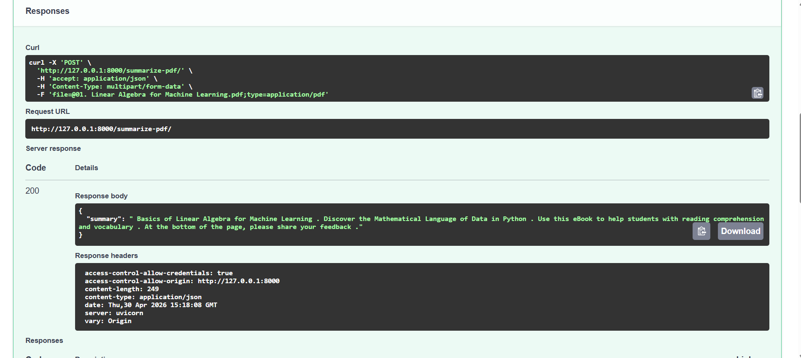

# AI Text Summarizer

- This project is a web-based application that summarizes text and PDF using AI.
- In this project i used pythom FastAPI to create Framework it can handelroutes, request,responses.
- i used HuggingFase(pre- trained AI model) so basically it is trained NLP model which will convert long text into small summary it uses PyTorch which will handel deep learning computation
- i used "pdfminer" library which extract text from PDF files

## Workflow Steps
- User enters text or uploads PDF
- Frontend (JS) sends request using fetch()
- FastAPI receives request
- If PDF → extract text
- Text sent to HuggingFace model
- Model generates summary
- Backend sends response
- Frontend displays summary

## Tech Stack
- Frontend: HTML (structure), CSS(design), JavaScript(Communicate with backend API)
- Backend: FastAPI (Python)
- AI Model: HuggingFace Transformers (free to use )

## Features
- Text summarization
- PDF summarization
- Simple UI

## To Run Locally In Your PC

### Backend (write these syntax in bash)
- cd backend  
- pip install -r requirements.txt  
- uvicorn main:app --reload  

### Frontend
Open index.html in browser (http://127.0.0.1:8000/docs)

- Webpage 

- select options from "pdf" and "text"

- upload your "pdf"

- You can see summary

